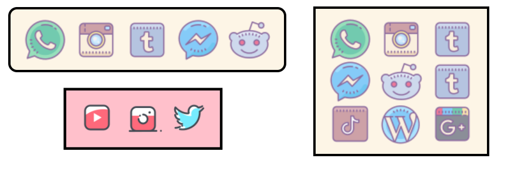

# Plug Yourself Library Documentation



**Intro:**
The purpose of the ‘Plug Yourself’ library is to help developers create beautiful looking social media profile links on their websites. The library will return a toolbar of buttons, with each button corresponding to a social media profile. The library allows the user to choose which profiles to add to the toolbar. Given the profile type and link, the library will create a button with an icon associated with the profile type. For example, if the user created an Instagram button, the toolbar will contain an Instagram icon that links to the specified Instagram profile. The icon images used for the buttons are taken from existing icon packs. As a result, the library allows the user to switch between icon packs for every button at once. 

**Setup:**

Place the plug_yourself.js file in the same directory as the program you will be working on.

To start using the Plug Yourself, you must first include the javascript script to the program. You can do
this by copying the following line into the body section in your html file.

<script type="text/javascript" src='plug_yourself.js'></script>

The library API can be accessed through javascript calls. As a result you will also need to create another

javascript file to call the library API functions. You can do this by copying the following line into the body

section in your html file. In our example we call this file “examples.js” but you can call it anything.

<script defer type="text/javascript" src='examples.js'></script>

Now lets try using the library to create a toolbar of social media buttons. We can do this by writing the

following code in our “examples.js” file.
```
var t1 = new PlugYourself()
var a = t 1 .getBar()
document.querySelector("body").append(a)
```
The first line of code creates an instance of the toolbar. The second line of code assigns the toolbar
object to a variable. Then in the third line we use this variable to add the toolbar to our document. In

our example we appended the toolbar to the body tag but it can be appended to any div as well. Now
we have created a toolbar on our page. It is completely empty at the moment so we will use the

functions in our library API to populate the toolbar.

Library API
```
1. addButton(String: type, String: link)

Creates a button on the toolbar with the appropriate image for the type
and link it links to. Link must be an appropriate website link. The
supported arguments for type are [“facebook”, “instagram”, “youtube-
play”, “tiktok”, “twitter”, “tumblr”, “wordpress”, “linkedin”,
“pinterest”, “facebook-messenger”, “whatsapp”, “github”, “google-
plus”, “reddit”, “share”]

Sample usage:
t1.addButton(“facebook”, “https://www.facebook.com/”)
```
```
2. setIconTheme(String: theme)
Changes the icon pack that will be used to visualize the toolbar.
Supported arguments for theme are [“color”, “gradient”, “cute_outline”,
“cute”, “dotted”, “cloud”, “hand_drawn”, “doodle”, “bubbles”,
“hand_drawn_outline”, “office”, “clipart”, “blue”]
Sample Usage:
t1.setIconTheme(“hand_drawn_outline”)
```
```
3. setIconSize(int: size)
    Changes the button icon sizes to the given size.
```
```
4. shapeToVertical()
    Changes toolbar orientation from horizontal to vertical
```
```
5. maxInRow(int: max)
    Set the maximum number of buttons allowed in one row. This function can be
    used to create rectangle and square shapes
```
```
6. openInNewTab()
    Toolbar buttons will open links in a new tab instead of current window
```
```
7. addHoverDarken()
    Creates a darkened animation over the buttons when hovering over the
    buttons
```
```
8. addRoundedCorners()
    Makes corners rounded on the toolbar
```
```
9. setBorderColour(String: colour)
    Changes toolbar border colour to given colour
```
```
10. setColour(String: colour)
    Changes toolbar background colour to given colour
```
```
11. getBar()
    Returns toolbar object
```

